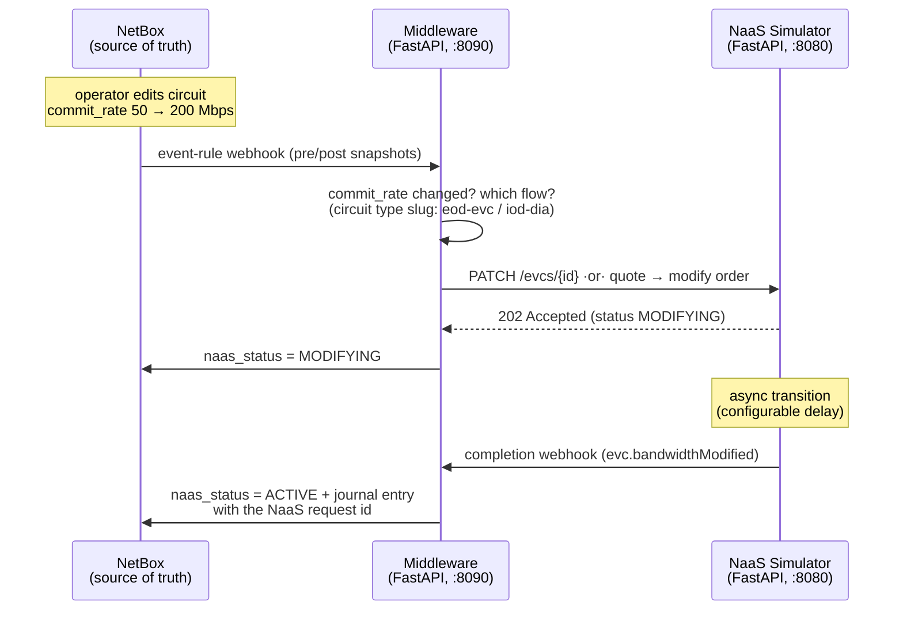

# Lumen NaaS Simulator + NetBox Closed-Loop Automation

[](https://github.com/b11011/naas-sim/actions/workflows/ci.yml)

[](LICENSE)

A stateful simulator of Lumen's two public bandwidth-on-demand APIs — [Ethernet On-Demand v5](https://d26yp52fi26crs.cloudfront.net/docs/ethernet-on-demand/openapi/Ethernet_On-Demand_API_8_1_2025.yaml) and [Internet On-Demand](https://d26yp52fi26crs.cloudfront.net/docs/internet-on-demand/openapi/Internet_On-Demand_2_19_2026.yaml) — built so network-automation solutions can be developed and tested without a carrier account. On top of it sits a working **closed-loop NetBox integration**: edit a circuit's `commit_rate` in NetBox and event-driven middleware reconciles the "network" to match, then writes the confirmation back to NetBox's journal.

> **Disclaimer:** independent project for development and education, based solely on Lumen's publicly published OpenAPI specifications. Not affiliated with, endorsed by, or representing Lumen Technologies.

## Architecture



The simulator also works standalone — Swagger UI at `/docs`, OAuth2 client-credentials, and every flow drivable with `curl` or the clients in [`examples/`](examples/).

## 60-second quickstart

```bash
git clone https://github.com/b11011/naas-sim && cd naas-sim
python -m venv .venv && source .venv/bin/activate && pip install -r requirements.txt
NAAS_SIM_DELAY_SECONDS=3 python -m simulator &     # http://localhost:8080/docs

# one end-to-end bandwidth change (OAuth token → PATCH → poll to convergence):
python examples/eod_change_bandwidth.py --bandwidth 200
```

```text
current: 50 Mbps (ACTIVE)
accepted: request 57b6e8d1-b1de-40d5-ad9b-0d02a04037cf status MODIFYING
  waiting... status=MODIFYING bandwidth=50
done: EVC e27a48de-7ab1-46dc-a0b0-a0abea016b5d is ACTIVE at 200 Mbps
```

Raw-curl versions of both flows (and everything else) are in the [manual](docs/MANUAL.md). Tests: `pytest`.

## What's simulated (and why it's faithful)

| Behavior | Real platform | Simulator |
|---|---|---|
| Bandwidth change, L2 EVC | `PATCH /evcs/{id}` → 202, `MODIFYING` → `ACTIVE` | same state machine, configurable delay |
| Bandwidth change, DIA | qualify → quote → order (`action: modify`) | same 3-step pipeline |
| Quote lifetime | 15 minutes | enforced (configurable) |
| Change-request quota | 24/day per customer, GMT reset | enforced → `429` |
| Auth | OAuth2 client-credentials | same flow, fake creds |
| Async completion | webhooks + order status | webhook fan-out + request records |
| Guardrails | UNI capacity, order-contact validation, site restrictions | all enforced with Lumen-style `{code, message}` errors |

Seed data reuses the identifiers from Lumen's own documentation examples, so requests copied from the vendor docs run unchanged against the lab.

## Design notes

- **Async is the point.** Provisioning APIs answer `202` and converge later; the simulator forces clients to handle `MODIFYING` states, poll or subscribe, and reject concurrent changes (`400` while a change is in flight) — the exact discipline the real platform demands.
- **Two deliberately different flows.** Ethernet On-Demand is a direct resource `PATCH`; Internet On-Demand is a TMF-style commerce pipeline (price → quote with TTL → order). The NetBox middleware abstracts over both behind one intent: *set this circuit to N Mbps*.
- **NetBox stays a source of truth, not an orchestrator.** Execution lives in a thin reconciler; NetBox holds desired state (`commit_rate`) and receives confirmations (custom field + journal). Event-rule webhooks carry pre/post-change snapshots — the middleware uses them both to filter no-op edits and to break the write-back loop.
- **Failure honesty.** An impossible request (bandwidth over UNI capacity, expired quote, quota hit) leaves NetBox showing desired ≠ actual with a red journal entry — surfaced drift, not silent rollback.
- **Everything configurable via env** (transition delay, quote TTL, quota, creds — see [`.env.example`](.env.example)); tests run the full lifecycle at a 0.2 s delay.

## Repo layout

```
simulator/    the FastAPI app: auth, both API surfaces, webhook fan-out, /_lab controls
middleware/   NetBox→NaaS reconciler (Phase 2: event-driven closed loop)
scripts/      seed_netbox.py (idempotent NetBox model+data) · change_bandwidth.py (NetBox custom script, Phase 1)
examples/     standalone clients for both flows + webhook receiver
tests/        end-to-end lifecycle tests (pytest, one command)
docs/         full user manual
```

## License

[MIT](LICENSE)
